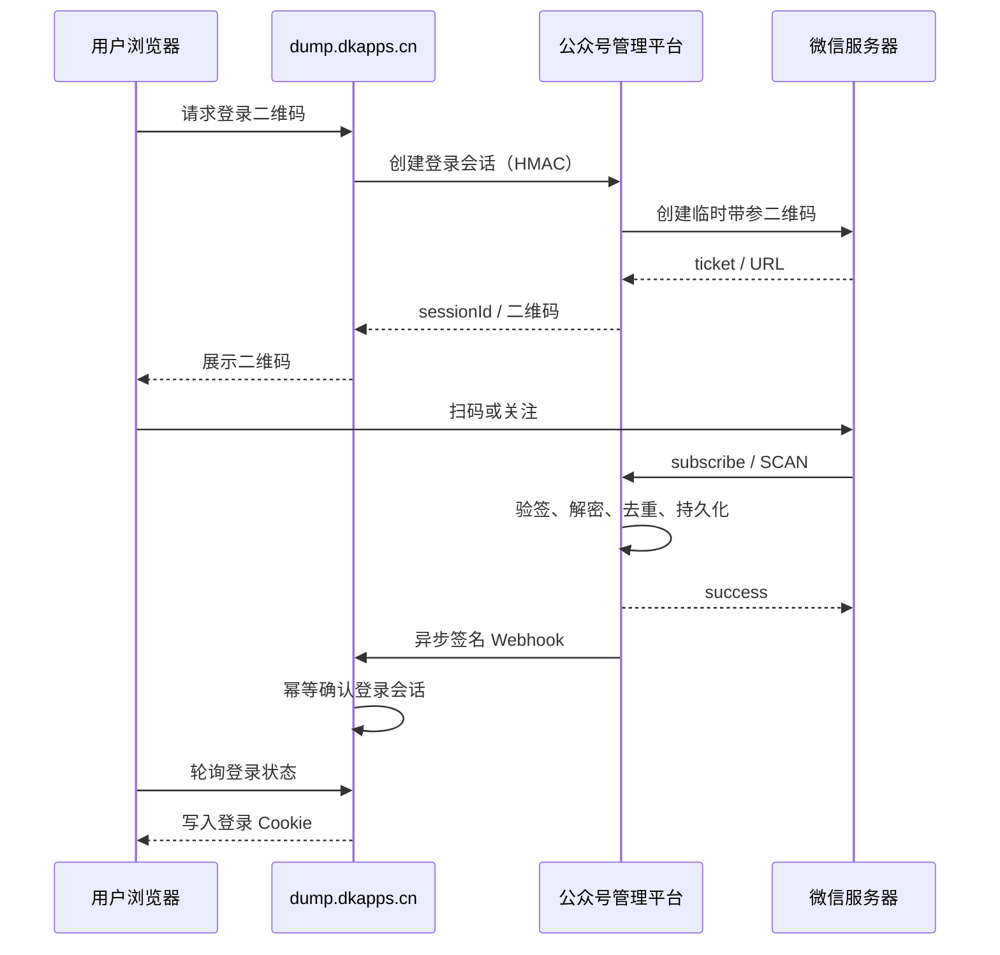

# 微信公众号扫码登录联动方案

## 1. 目标

将现有微信公众号管理平台
`wechat-official-account-admin-main` 与私有砸壳平台
`dump.dkapps.cn` 联动，实现：

- 用户扫描带参数二维码并关注公众号后登录。
- 已关注用户再次扫码后直接登录。
- 首次关注并完成首次登录赠送 5 次砸壳次数。
- 次数用完后通过卡密充值。
- 任务完成、最终失败和下载即将过期时发送站内通知，并尽力发送微信通知。
- 微信协议能力与砸壳业务解耦，任一系统短暂故障时可以恢复和补偿。

本项目尚未正式上线，因此按全新系统设计，不提供旧普通用户、旧会话或旧余额的迁移兼容。

## 2. 已确认的代码基础

微信公众号管理平台已经具备以下能力：

- 微信回调入口：`GET/POST /wxmp/:appid/handler`。
- 微信 Token 签名验证和 AES 入站消息解密。
- 临时及永久带参数二维码创建。
- `subscribe`、`unsubscribe` 事件处理。
- OpenID、UnionID、关注状态和二维码场景持久化。
- 基于 Redis 的公众号 `access_token` 统一缓存和刷新锁。

仍需补齐：

- `SCAN` 事件当前只有日志和 `TODO`，需要与 `subscribe` 统一进入场景事件处理器。
- 二维码接口当前依赖浏览器管理员会话，需要增加服务间内部 API。
- 缺少持久化的业务事件投递队列、Webhook 重试和死信处理。
- 缺少业务应用接入管理、HMAC 凭证及连接测试。

dump 当前自行生成公众号二维码、刷新微信 `access_token` 并接收微信回调。公众号只能配置一个消息服务器地址，这套重复实现必须移除或停用，避免回调冲突和 Token 竞争。

## 3. 架构原则

### 3.1 唯一微信网关

微信公众号管理平台是唯一微信协议网关，负责：

- AppID、AppSecret、Token、EncodingAESKey。
- 微信回调验签、解密和事件解析。
- 公众号 `access_token` 获取、缓存和刷新。
- 带参数二维码生成。
- 关注状态与微信用户资料。
- 微信消息发送。
- 向业务应用可靠投递事件。

dump 是业务客户端，负责：

- 本站登录会话与 Cookie。
- 用户状态、次数余额、卡密和流水。
- 砸壳任务、设备调度与结果归属。
- COS 对象和下载授权。
- 站内通知和业务审计。

两个系统不得互相直连数据库。

### 3.2 总体流程



## 4. 用户与权限模型

### 4.1 用户身份

- 主身份键：`appid + openid`。
- `unionid` 可选保存，仅在未来接入同一开放平台下的其他公众号或小程序时用于账号合并。
- 昵称和头像仅用于展示，不作为身份凭据。
- 未确认可靠 UnionID 前，不自动合并不同公众号的 OpenID。

底层数据结构支持多个 AppID，首版只启用一个主公众号。

### 4.2 关注状态

- 未关注用户必须完成关注才能登录。
- 已关注用户扫码收到 `SCAN` 后直接登录。
- 取消关注后保留余额、历史任务和下载权限，但禁止创建新任务。
- 正在执行的任务不因中途取消关注而终止。
- 重新关注后恢复原业务状态，不重复发放首次关注赠送。

### 4.3 用户业务状态

- `active`：正常登录和提交任务。
- `restricted`：可登录、查看历史和下载已有结果，不能创建任务。
- `banned`：禁止登录，撤销现有会话。
- `deleted`：用户注销后的匿名化状态。

关注状态与业务状态分别保存。管理员限制或封禁必须填写原因和可选到期时间。

### 4.4 次数与卡密

- 首次关注并完成首次登录赠送 5 次。
- 赠送记录以 `appid + openid` 建立唯一约束，终身只发放一次。
- 取消后重新关注不重复赠送。
- 后续通过卡密或管理员人工调整余额。
- 任务成功进入执行队列时预扣 1 次。
- 用户在任务执行前取消，或系统、设备、COS 等原因导致最终失败时自动退回。
- 已成功生成 IPA 后，不因用户未下载而退回。
- 所有赠送、充值、预扣、退款和人工调整均写入不可变余额流水。

## 5. 登录会话

登录会话状态：

- `pending`
- `confirmed`
- `consumed`
- `expired`

规则：

- 默认有效期 5 分钟。
- 一个二维码只能成功登录一次。
- 会话绑定浏览器随机 nonce，防止登录结果被其他浏览器冒领。
- 登录成功后立即标记为 `consumed`。
- 对 IP、浏览器和 OpenID 设置二维码创建频率限制。
- dump 登录 Cookie 默认 7 天，使用 `HttpOnly`、`Secure`、`SameSite=Lax`。
- 用户退出或被封禁时撤销服务端会话。

前台首页、热门应用、搜索和应用详情允许匿名访问；提交任务、任务列表、余额、卡密兑换和下载必须登录。登录完成后恢复用户登录前准备执行的操作。

## 6. 服务间接口

### 6.1 认证

不得复用管理员 Token。为 dump 创建独立业务应用凭证：

- `client_id`
- 32 字节以上随机密钥
- 允许使用的 AppID
- Webhook 地址
- 启用状态

请求采用 HMAC-SHA256，签名输入至少包含：

```text
HTTP_METHOD
REQUEST_PATH
TIMESTAMP
NONCE
SHA256(REQUEST_BODY)
```

服务端要求：

- 时间偏差不超过 5 分钟。
- nonce 只能使用一次。
- 事件通过 `event_id` 幂等消费。
- 支持密钥轮换期间新旧密钥短暂并行。
- 日志不得记录完整签名、密钥或 Cookie。

### 6.2 建议 API

公众号平台：

```text
POST /internal/v1/login-sessions
GET  /internal/v1/login-sessions/:sessionId
POST /internal/v1/messages
GET  /internal/v1/apps/:clientId/health
```

dump：

```text
POST /api/internal/wechat/login-events
POST /api/internal/wechat/subscription-events
POST /api/internal/wechat/message-status-events
GET  /api/internal/wechat/health
```

浏览器继续只访问 dump：

```text
POST /api/wechat/login/qrcode
GET  /api/wechat/login/status
POST /api/wechat/logout
```

### 6.3 登录事件负载

建议字段：

```json
{
  "eventId": "evt_xxx",
  "eventType": "wechat.login.confirmed",
  "clientId": "dump",
  "sessionId": "login_xxx",
  "appId": "wx...",
  "openId": "o...",
  "unionId": null,
  "subscribed": true,
  "scene": "dump_login_xxx",
  "occurredAt": "2026-07-28T00:00:00Z"
}
```

## 7. 微信事件处理

将 `subscribe` 与 `SCAN` 归一化到统一 `HandleSceneEvent`：

- 新用户扫码关注：从 `qrscene_<scene>` 中提取场景。
- 已关注用户扫码：直接使用 `SCAN` 的 EventKey。
- 校验场景前缀、业务应用、登录会话状态和有效期。
- 更新微信用户关注状态。
- 生成唯一业务事件并写入持久化事件表。
- 立即向微信返回 `success`，不等待 dump。

`unsubscribe` 事件更新关注状态并异步通知 dump，使用户不能继续创建新任务。

## 8. 可靠事件投递

首版使用现有 MongoDB 持久化事件表和 Redis 分布式锁，不引入 Kafka 或 RabbitMQ。

事件状态建议：

- `pending`
- `delivering`
- `delivered`
- `dead_letter`

失败采用指数退避，例如：

- 5 秒
- 30 秒
- 2 分钟
- 10 分钟

达到最大次数后进入死信，触发企业微信告警。后台支持查看事件、响应摘要和手动重投。dump 按 `event_id` 建立唯一约束，重复投递不得重复登录、赠送或扣费。

## 9. 通知与下载

### 9.1 通知

- 站内通知是业务状态的权威来源。
- 任务完成、最终失败和下载即将过期时，dump 调用公众号平台内部消息接口。
- 公众号平台根据实际公众号权限发送可用的模板、订阅或客服消息。
- 微信发送失败不改变任务成功状态。
- 同一任务同一事件只通知一次，后台支持审计和手动重发。
- 微信消息跳转到 dump 任务详情页，不直接发送长期 COS 签名地址。

### 9.2 COS 下载

- 用户必须登录并拥有对应任务。
- 点击下载时由 dump 即时生成短期 COS 签名地址，建议有效 15 分钟。
- COS 文件继续按现有策略保留 24 小时。
- 文件保留期内，用户可以重新获取新的短期签名地址。
- 管理员生成下载地址必须写入审计日志。

## 10. 后台功能

### 10.1 公众号管理平台

增加“业务应用接入”模块：

- 创建、启用、暂停业务应用。
- 配置 `client_id`、Webhook、状态查询地址和允许的 AppID。
- 生成、轮换和停用 HMAC 密钥。
- 配置二维码场景前缀。
- 查看事件投递、重试和死信。
- 测试连接和发送测试事件。

### 10.2 dump 管理后台

增加“微信公众号登录”配置：

- 启用状态。
- 公众号平台内部 API 地址。
- `client_id` 和 HMAC 密钥。
- 当前 AppID、公众号名称和连接状态。
- 二维码有效期、Cookie 有效期和首次赠送次数。
- Webhook 地址和双向连通性测试。
- 通知策略和测试二维码。

测试二维码不得赠送次数或创建正式余额。

### 10.3 管理员角色

- 超级管理员：公众号、业务应用、密钥和安全策略。
- 运营管理员：用户、次数、卡密和售后。
- 任务运维：设备、队列、COS 和故障。
- 审计只读：只读查看登录、余额、卡密、任务和通知。

高风险操作需要再次确认并写入审计记录。

## 11. 故障降级

公众号平台不可用时：

- 已登录且会话有效的用户继续使用。
- 新登录明确提示微信登录暂不可用。
- 已入队任务继续执行。
- 首次赠送必须等待可信关注事件，不离线猜测。
- 微信通知进入重试队列，站内通知照常生成。
- 连续失败达到阈值后通知企业微信机器人。

企业微信机器人只发送运维告警，不发送普通用户任务完成消息。告警需要按错误指纹合并并设置冷却时间，恢复后发送一次恢复通知。

## 12. 数据保留与隐私

- 过期二维码会话保留 7 天。
- 原始微信回调 XML 默认不落盘。
- 登录审计保留 180 天。
- 成功 Webhook 记录保留 30 天，失败记录保留 90 天。
- OpenID、关注状态、余额和任务归属在用户存在期间保留。
- 管理页面默认展示脱敏 OpenID。
- 注销后删除登录资料；卡密和余额流水按审计要求匿名化保留。
- 日志不得记录 AppSecret、EncodingAESKey、HMAC 密钥、Cookie 或完整 COS 签名地址。

## 13. 安全整改

在正式联调前完成：

- 轮换截图中已经暴露的 AppSecret、Token 和 EncodingAESKey。
- 将公众号管理平台硬编码的 Web Session 密钥移到安全配置并轮换。
- 管理后台不再返回完整 AppSecret、Token 和 EncodingAESKey。
- 敏感配置使用服务端密钥存储或加密存储，前端留空表示不修改。
- 普通用户与管理员认证完全隔离。

## 14. 分阶段实施

### 阶段 1：微信网关

- 补齐 `SCAN` 事件。
- 实现场景事件归一化与事件去重。
- 建立持久化事件表、Worker、重试和死信。
- 完成微信回调相关单元测试。

### 阶段 2：内部 API

- 增加业务应用及密钥管理。
- 实现 HMAC 中间件。
- 实现登录会话创建、状态查询和事件 Webhook。
- 完成签名、过期、nonce 重放和幂等测试。

### 阶段 3：dump 登录

- 移除 dump 对微信 AppSecret 和 `access_token` 的直接依赖。
- 接入二维码、状态查询和 Webhook。
- 实现用户、关注状态、登录会话和 Cookie。
- 增加首次关注赠送 5 次的唯一流水。

### 阶段 4：业务权限

- 任务归属。
- 次数预扣与失败退款。
- 卡密充值。
- 用户状态控制。
- 短期 COS 下载授权。

### 阶段 5：通知与后台

- 微信任务通知。
- 企业微信运维告警。
- 两端配置页、事件日志、死信重投和审计。

### 阶段 6：联调与灰度

- 使用测试业务应用完成新关注、已关注扫码、取消关注、重复事件、服务离线和恢复测试。
- 验证二维码过期、跨浏览器冒领防护、重复赠送防护和 Cookie 撤销。
- 验证任务预扣、退款、COS 过期和通知补偿。
- 正式 AppID 灰度开启后，再强制普通用户使用微信登录。

## 15. 验收标准

- 新用户扫码关注后在 5 秒内完成登录并只获得一次 5 次赠送。
- 已关注用户扫码后可直接登录。
- 相同微信事件重复投递不会重复登录、赠送或修改余额。
- 取消关注后不能创建新任务，历史任务和有效下载仍可访问。
- Webhook 暂时失败后能够自动补偿，重试耗尽后进入可操作的死信列表。
- 公众号平台停机不影响已登录用户和已入队任务。
- 普通用户不能访问其他用户任务或下载地址。
- HMAC 重放、过期请求和错误密钥均被拒绝。
- 日志、接口和管理页面不泄露任何微信或服务端密钥。
- 任务完成后站内状态准确；微信通知失败不会把成功任务标记为失败。

## 16. 当前实施与验证状态

阶段 1–6 已按本方案实现。当前本机已经完成：

- 微信公众号管理平台 `go test ./...`。
- HMAC 签名、时间窗口、nonce 重放和请求体篡改单元测试。
- dump 数据库的复合微信身份、首次赠送、事件幂等、额度扣除与退款测试。
- dump `npm run check` 与全部 Node 测试。
- 微信公众号管理前端生产构建。
- 使用隔离 SQLite 和任务状态路径启动 dump，并验证健康接口和未配置网关时的安全拒绝。

真实微信 `subscribe`、`SCAN`、客服消息和 Cloudflare 公网链路仍必须使用正式测试公众号完成最终联调，操作清单见 `wechat-linkage-deployment.md`。
